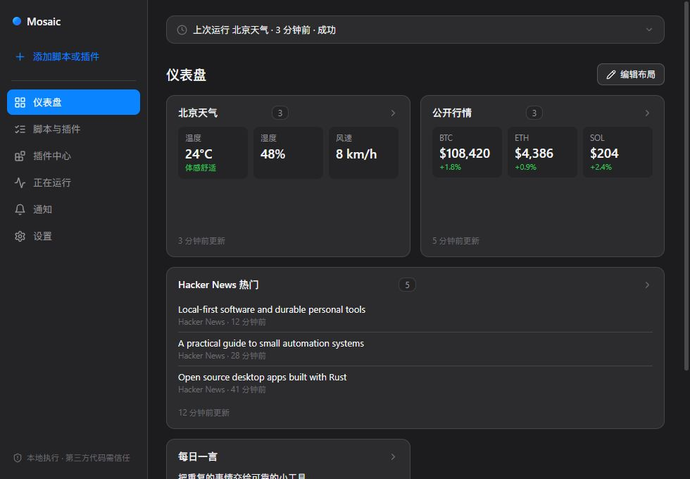
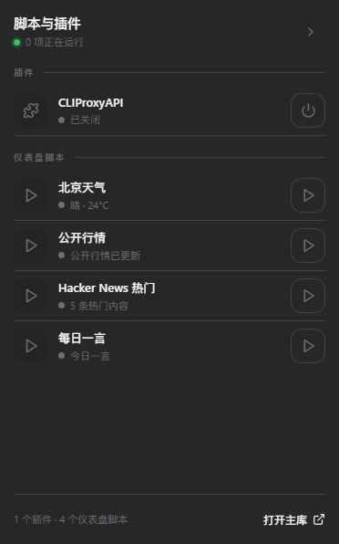

<p align="center">
  
</p>

# Mosaic Desktop Automation

> A local-first Windows dashboard for scheduling, watching, running, and visualizing scripts and plugins.

[](LICENSE)
[](docs/INSTALLATION.md)
[](https://tauri.app/)
[](https://github.com/Quill-00/mosaic-desktop-automation/releases)

[简体中文](README.zh-CN.md)

Mosaic is a local-first script runner, scheduler, file watcher, and plugin dashboard for Windows. It requires no account, subscription, activation code, device binding, or license gate. Tasks and results stay on your computer.

The interface supports English and Simplified Chinese. On first launch, UTC+8 systems default to Chinese; every other timezone defaults to English. A manual language choice is remembered and shared with the desktop widget.



## What it does

- Runs tasks manually, at intervals, daily, weekly, or monthly.
- Watches folders with glob filtering and debounce protection.
- Starts and stops resident plugins with process-tree management.
- Renders JSON or line-oriented output as lists, news, metrics, tables, and Markdown cards.
- Shows execution history and recent files from configured output folders.
- Installs community packages from HTTPS registries after SHA-256, path, and size checks; new packages stay disabled.
- Provides a compact desktop widget for quick script and plugin control.
- Downloads verified updates only from GitHub Releases and installs them on the next launch.



## Install

1. Open the [latest GitHub Release](https://github.com/Quill-00/mosaic-desktop-automation/releases/latest).
2. Download `Mosaic-Setup-<version>.exe` and the matching `.sha256` file.
3. Verify the installer in PowerShell before running it:

```powershell
$installer = '.\Mosaic-Setup-0.3.2.exe'
$actual = (Get-FileHash -LiteralPath $installer -Algorithm SHA256).Hash.ToLowerInvariant()
$expected = (Get-Content "$installer.sha256" -Raw).Split(' ', [System.StringSplitOptions]::RemoveEmptyEntries)[0].ToLowerInvariant()
if ($actual -ne $expected) { throw 'SHA-256 mismatch. Delete the installer and download it again.' }
```

Continue only when the command completes without an error. See the [installation guide](docs/INSTALLATION.md) for system requirements, upgrades, and uninstall instructions.

## First-run examples

A new data directory contains only credential-free public examples:

- One Open-Meteo weather task demonstrates live cards without an API key, cookie, or account. UTC+8 installations receive the Chinese example; other timezones receive the English example.
- `CLIProxyAPI` is bundled from a pinned official MIT-licensed Release after SHA-256 verification and stays disabled by default. Mosaic includes the upstream `config.example.yaml` for reference, but runs against a separate credential-free template copied into the user's application-data directory. No build-machine CPA configuration, OAuth file, or login credential is read or packaged.
- The official community source includes `Hello Mosaic` and a keyless Open-Meteo weather script. Installed packages remain disabled until the user reviews and enables them.

You can disable or delete every example.

## Import scripts and plugins

Open **Scripts & plugins → Add**, paste the full path to a script or project, and select **Detect entry point**. Mosaic recognizes Python, Node.js, TypeScript, PowerShell, batch, shell, Ruby, Rust projects, and local executables.

Single script files are copied to Mosaic's local data directory. Full projects remain referenced in place so dependencies and project data are not duplicated. See [Importing scripts and plugins](docs/IMPORTING-SCRIPTS-AND-PLUGINS.md) for triggers, stdout output, resident plugins, and community package structure.

Minimal structured stdout:

```json
{
  "summary": { "headline": "3 items completed", "count": 3 },
  "card": { "type": "metric", "title": "Daily tasks", "metrics": [{ "label": "Done", "value": "3" }] },
  "items": [{ "title": "Generated daily report", "at": "2026-09-01T08:00:00Z" }]
}
```

## Community source

The official registry is hosted as static content on GitHub:

```text
https://raw.githubusercontent.com/Quill-00/mosaic-desktop-automation/main/community/registry.json
```

Package and registry traffic does not depend on a central download server. See the [community registry guide](community/README.md) for the format, publication workflow, and trust boundary.

## Privacy and security

- No account, telemetry, advertising, license check, or subscription gate.
- Mosaic does not upload local tasks, results, paths, or credentials.
- Version checks send only the current version and a fixed public Mosaic application identifier. Installer bytes come from GitHub Releases.
- User-entered channel secrets such as QQ AppSecret are stored in Windows Credential Manager, not `db.json`.
- Third-party scripts run with the current Windows user's permissions. Static analysis is a risk hint, not a sandbox or replacement for source review.
- If GitHub cannot be reached, Mosaic reports the connection problem, preserves the current version, and removes incomplete downloads.

Read the [privacy and security guide](docs/PRIVACY-AND-SECURITY.md) before distributing a modified build.

## Build from source

Requirements: Node.js 20+, pnpm, stable Rust, Visual Studio C++ Build Tools, and WebView2. Inno Setup 6 is also required for the installer.

```powershell
pnpm install
pnpm build
cargo test --manifest-path .\src-tauri\Cargo.toml
pnpm tauri dev
pnpm package:inno
```

`pnpm package:inno` builds and tests the app before creating the installer and `.sha256` file. Generated output stays in ignored local directories.

## Contributing

Bug reports, feature proposals, documentation, translations, and community packages are welcome. Read [CONTRIBUTING.md](CONTRIBUTING.md) and [SECURITY.md](SECURITY.md) first. Never submit credentials, private paths, runtime databases, logs, desktop backgrounds, or conversation history.

## License

[MIT](LICENSE) © 2026 Mosaic contributors
